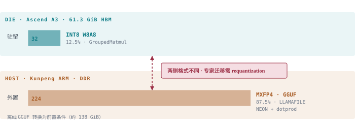
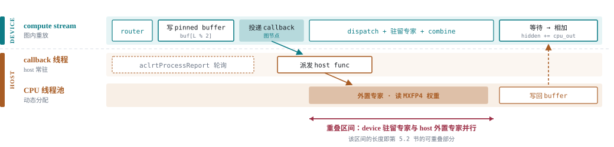
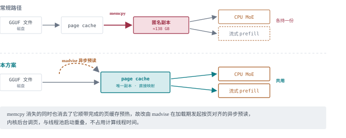
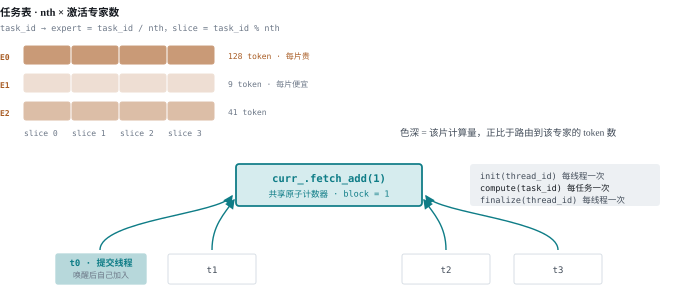
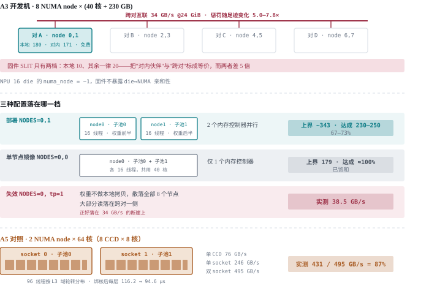
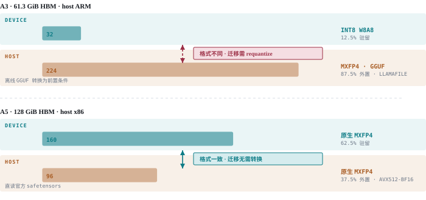
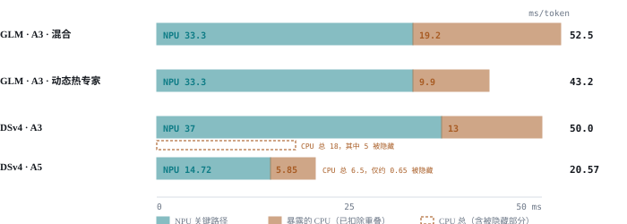
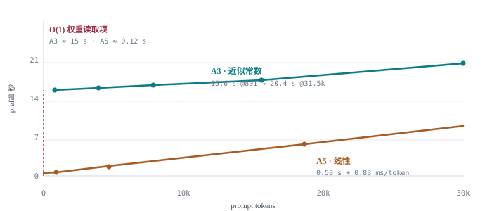
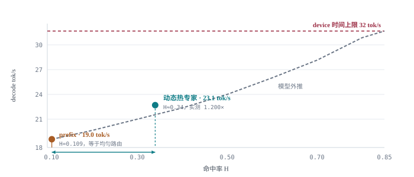
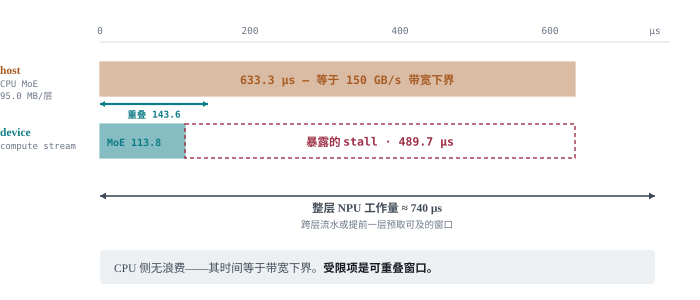

# 昇腾单卡 300B 大模型部署

在单张昇腾 A3 die（Ascend 910C，61.3 GiB HBM）上部署 DeepSeek-V4-Flash 与 GLM-5.3-Flash。两者 W8A8 权重分别约 275 GiB 与 306 GiB，路由专家占九成以上，经 KTransformers 卸载至 host 内存，由 CPU 计算并与 NPU 重叠。GLM-5.3-Flash 单卡 decode 19~22.0 tok/s、15.8k prompt 的 TTFT 26.6 s；DSv4-Flash 20~23 tok/s；A5（Ascend 950PR，128 GiB HBM）46–49 tok/s。

---

## 1. 核心亮点

1. **单卡承载 300B 级 MoE**：权重 4.5–5 倍于单 die HBM，路由专家外置 87.5%–88.9%。
2. **CPU 侧贴近内存带宽上界**：单节点已饱和，双节点达流式上界的 67–73%；余下部分能否被 GEMV 负载取到，尚未测定。
3. **动态热专家**：驻留命中率 `H` 由 0.109 提至 0.34，TPOT `1.200× ± 0.017`。
4. **side stream 重叠**：CPU host callback 与 NPU 驻留专家并行，decode 增益约 12%（A5 上为 −5.97 ms/token）。
5. **流式 prefill**：整层专家流入复用 HBM slot，单 chunk 固定成本约 19 s，与 chunk 内 token 数无关。同一 13.9k prompt，单 chunk 25.5 s、三 chunk 63.9 s，**2.50×**。
6. **多模态可用**：OCR、计数、空间关系与多图请求均验证通过；视觉塔权重本已驻留 die，不额外占用卸载预算。

---

## 2. 模型与容量约束

| 项 | DeepSeek-V4-Flash | GLM-5.3-Flash |
|---|---|---|
| 层数 | 43，全 MoE | 45（34 KDA + 11 DSA），MoE 层 3–44 |
| 路由专家 / top-k | 256 / 6 | 288 / 8 |
| hidden / moe_inter | 4096 / 2048 | 4096 / 2048 |
| W8A8 权重 | ≈275 GiB | 306.09 GiB |
| **路由专家占比** | **258.3 GiB · 93.9%** | **290.63 GiB · 95.0%** |
| 单 die HBM | 61.3 GiB | 61.3 GiB |



*图 1 · A3 卸载结构。驻留 INT8、外置 MXFP4 GGUF，两侧异构。*

单专家单层的显存开销由形状直接给出，两模型相同：

```
单专家单层 = 3 × 8 MiB (I8) + 32 KiB (F32 per-channel scale) = 24.03 MiB
host 侧 MXFP4  = 3 × 4096 × 2048 参数 × 4.25 bit             = 12.750 MiB

每专家全模型   GLM 42 层 = 0.9857 GiB    DSv4 43 层 = 1.0091 GiB
```

- **容量公式**（部署值）`die 权重 = 15.60 + 6.75×[流式] + 0.9925×N` GiB，`N` 为驻留专家数。斜率 0.9925 含约 0.22 GiB 运行时裕度。
- **格式约束**：A3 不支持 fp8。device 侧只能 INT8 W8A8（每输出通道一个 FP32 系数），host 侧 MXFP4（4.25 bit/权重）。**两侧异构，专家迁移需 requantization。**
- **A5 对照**：950PR 原生支持 MXFP4，两侧同构，直读官方 safetensors，无 GGUF 转换环节。

**驻留专家数与显存分配**（GLM-5.3-Flash，混合路径）

| N | die 权重 | 61.3 剩余 | 用途 |
|---:|---:|---:|---|
| **32** | **47.36** | **13.94** | 标准配置，32K 上下文 |
| 40 | 55.30 | 6.00 | 余量不足 |

> 驻留专家与 KV 池共用同一块 HBM，二者的分配是全文所有取舍的来源。

---

## 3. 卸载架构

### 3.1 专家划分

- placement mask 在模型加载时建立，服务期只读；非驻留专家跳过 device 侧分配，权重不进 die。
- 昇腾路由算子不接受"不在本 device 计算"的哨兵值，落 CPU 的项改写为**合法驻留编号 + 权重 0**，device 侧照常执行且不贡献输出。
- 该改写使 device 侧算子形状在 token 间恒定，可被图捕获。

### 3.2 NPU–CPU 同步

图模式下一个 decode step 整体重放，CPU 计算须以**图节点**参与。



*图 2 · 单层协调序列。上半为 device 侧，下半两条泳道均在 host 侧。投递 callback 为图节点，投递后计算流不等待；红色区间为可重叠部分。*

```python
# hook 1：dispatch 前，在未重排的 token 上提交
def _ascend_pre_dispatch(self, dispatcher, hidden_states, topk_output):
    _ensure_npu_subscribe_report(stream)          # 订阅须早于图捕获
    self.wrapper.copy_inputs_to_cpu_buffers(hidden_states, topk_ids, topk_weights)
    torch_npu.npu._launch_host_func(              # 投递，被捕获为图节点
        stream, _kt_npu_graph_host_forward, (self.wrapper, hidden_states, handle))
    # 立即返回，计算流继续执行 dispatch 与驻留专家

# 回调体：由常驻线程在 aclrtProcessReport 轮询中派发
def _kt_npu_graph_host_forward(args):
    wrapper, hidden_states, stream_handle = args
    wrapper.run_pinned_forward_sync(hidden_states, stream_handle)   # 不得嵌套回调

# hook 2：combine 后汇合
def _ascend_post_combine(self, dispatcher, hidden_states):
    join_event.record(side_stream); compute_stream.wait_event(join_event)
    return hidden_states + self.sync(original, cpu_already_synced=True)
```

- pinned buffer 按层号奇偶分配两份；当前配置下 join 在本层内完成，两份为跨层重叠预留。
- placement mask 以 raw pointer 与 C++ 侧共享，驻留集合变更无需重载权重即被 CPU 侧观察到。
- callback 线程三处必须闭合，否则失效静默：**订阅晚于轮询启动**、**停止时再排空一次队列**、**取消订阅由订阅线程自己执行**。
- 非图路径改为同步提交：ACL callback 非阻塞触发且 host 不可观测，异步提交会读到上一层残留结果。

### 3.3 CPU 侧带宽利用

外置专家计算纯访存受限，目标是使内存控制器始终有未完成读请求。



*图 3 · 权重的内存路径。直接映射消去匿名副本，两个消费者共用同一份 page cache。*

- **权重不复制**：单 NUMA node 独占 tensor 时，三个投影指针直接指向权重文件映射。省约 138 GB 匿名内存，且 CPU 计算与流式 prefill 共用同一份 page cache。
- **取数与计算异步**：直接映射消去了拷贝顺带的 page cache 预热，改为加载期对三个投影发起按页对齐的异步预读，由内核后台调页。
- **双缓冲**：pinned buffer 按层号奇偶分配两份，为跨层重叠预留。当前部署下每层的 join 落在本层内，该冗余未被利用（见 7.3 第 8 项）。
- **池内动态分配**：任务粒度为 `(专家, 切片)` 对，共 `nth × 激活专家数` 个；所有线程以共享原子计数器每次取一个任务，等价于 `schedule(dynamic, 1)`。任务时长不等——同一专家各片的计算量正比于路由到它的 token 数——静态平分会使拿到冷专家切片的线程先空闲。
- **两种粒度**：作业分 `init` / `compute` / `finalize` 三段，前后两段按**线程**执行一次（线程私有缓冲的分配与归约），中间一段按**任务**执行。提交线程唤醒其余线程后不阻塞，作为 0 号线程加入任务循环。



*图 4 · 线程池的任务分配。任务为 (专家, 切片) 对，所有线程抢同一个原子计数器，每次取一个。*

### 3.4 NUMA 与线程

```
跨对访问 → 带宽自 171 降至 34 GB/s → 少量线程即饱和 → 外部观察与"带宽用满"不可区分
```

A3 的 8 个 NUMA node 两两成对，实测呈**三档**：本地约 180 GB/s、对内伙伴约 171（几乎免费）、跨对 34.0。而固件的 SLIT 距离矩阵只有**两档**——本地 10、其余一律 20——把"对内伙伴"与"跨对"标成等价，而两者差 5 倍。任何依据它放置内存的组件都会把 node 3 与 node 6 视为对 node 2 等距。

跨对惩罚**随足迹变化**：1 GiB 时 21.3 GB/s、8 GiB 时 22.7、24 GiB 时 34.0 并在此饱和，对应 7.8× / 7.1× / 5.0× 的惩罚比。已排除大页为因（`MADV_NOHUGEPAGE` 只改变 0.06%），机制未明。上界值取自 NEON 纯流式读：24 GiB 缓冲（为单节点 32 MiB L3 的 768 倍）、`mbind` 配 `move_pages` 逐页校验落位（`on_target = 100.000%`）、32 线程、≥5 次重复。

该失效是静默的：线程加到多少都不再变快，从吞吐曲线上与"内存带宽已用尽"无法区分。唯一判据是核实页面的实际落位。另有一项硬件限制：**16 个 NPU die 的 `numa_node` 均为 −1**，固件不暴露 die 与 NUMA 的亲和性，因此无法把 die 安排到与其权重同域的节点旁。



*图 5 · A3 的 8 节点拓扑与三种配置的落点。上界为 NEON 纯流式读实测（mbind 逐页校验落位），达成为 kt-kernel 的推算值。*

- **线程与权重必须落在同一内存域内**，且子池数须等于 NUMA node 数：单子池可直接复用文件页、省一份权重副本，多子池则复制到各节点以保本地性。
- **部署配置取一对内的两个节点**（`NODES=0,1`，核 0–79），2 子池各 16 线程、权重各持一半，两个内存控制器并行。流式上界约 343 GB/s，kt-kernel 达成 **约 230–250 GB/s（67–73%）**，**未饱和**。
- **单节点镜像**（`NODES=0,0`，核 0–39）只有一个内存控制器，上界 179 GB/s，**达成接近 100%，已饱和**。
- 上界是无算术的纯载入流，而真实路径是带解量化的 MXFP4 GEMV，可能受延迟或发射限制而达不到该上界。**双节点余下的约 30% 是否可取，尚未测定。**
- **配错即坠崖**：`NODES=0` 配 `tp=1` 时权重不做本地拷贝、散落全部 8 个节点，多数读落在跨对一侧，**实测 38.5 GB/s**——正落在 34 GB/s 那一档上。
- **A5** 为双路 x86，带宽呈三级层级：单 CCD 76、单 socket 246、双 socket 495 GB/s。配置 2 子池、96 线程，实测 431 GB/s（双路上界的 87%）。
- A5 上默认绑核按 NUMA 内密排，会把前 8 个 worker 全部放进同一个 CCD，上限仅 76 GB/s；改为**按 L3 域轮转**后，解码工作点每层 **116.2 → 94.6 µs（−18.6%）**。



*图 6 · A3 与 A5 卸载结构对照。驻留比例 12.5% 对 62.5%；A3 两侧异构、迁移需 requantize，A5 两侧同构。*

---

## 4. 时延分解

```
cpu_moe_wall = 每 token 字节数 × (1 − H) / B_H
TPOT         = NPU 关键路径 + max(0, cpu_moe_wall − 可重叠部分)

每 token 字节数  GLM  42 × top-8 × (1−H) × 12.75 MiB
                DSv4 43 × top-6 × (1−H) × 12.75 MiB
```

- 该量与专家总数无关，仅取决于 top-k。`GroupedMatmul` 实测运行于带宽下界 **1.00×**（107.3 µs 对 107.4 µs 理论），证实只读取被选中的 k 个专家。
- host 侧带宽：A3 取 150 GB/s——该值为 node 0 本地、线程亦在 node 0 的保守测量；后续在六个线程节点上的测量把空闲节点的本地带宽定在 171–180 GB/s，绝对上界随机器负载浮动而比值不随。A5 为 431 GB/s（双 socket 上界的 87%）。
- **NPU 关键路径因模型结构而异**：GLM 为 33.3 ms，分解为 KDA 10.4 / MoE 9.6 / DSA 5.4 / mHC 3.3；DSv4 为 37 ms——其 43 层全为 MoE，无 KDA 与 mHC。两者不可互相替代。A5 未在优化后重新 profile，其拆分未测。
- CPU 侧耗时须取**服务内实测**：独立 harness 为连续稳态 forward，与服务中每层一次小调用的工作模式不同，用其选参会误导。



*图 7 · 每 token 时延分解。条长为实测 wall time，CPU 段为扣除重叠后的暴露部分；虚框为 CPU MoE 的 kernel wall，其与 device 段重叠的部分即被隐藏的量。*

> † GLM 的 CPU 总为该 H 下的带宽下界推导值，其余为实测；‡ A5 的暴露量为端到端减 device-busy，其位置另由 trace 独立确认。

| 配置 | H | CPU 总 | 其中暴露 | NPU | 实测 | tok/s |
|---|---:|---:|---:|---:|---:|---:|
| GLM @ A3 混合 | 0.109 | 26.6† | 19.2 | 33.3 | 52.5 ms | 19.0 |
| **GLM @ A3 动态热专家** | **≈0.34** | **18.9†** | **9.9** | **33.3** | **43.2 ms** | **23.1** |
| DSv4 @ A3 | ≈0.26 | 18 | 13 | 37 | ≈50 ms | ≈20 |
| DSv4 @ A5 | 0.625 | 6.5 | 5.85‡ | 14.72 | 20.57 ms | 48.6 |

**字节项在 DSv4 上独立验证过。** 按其自身的命中率 `43 层 × top-6 × (1 − 0.26) × 12.75 MiB = 2.55 GB`，在 150 GB/s 下预测 CPU 耗时 17.0 ms，**对实测 18 ms，差 6%**。两个模型的 NPU 时间不同（33.3 对 37 ms），但同一个字节公式在两者上都成立。

> A3 实际工作点上 NPU 占 77%、CPU 暴露段占 23%。`H` 达 0.80 时 CPU 段归零，decode 转为 NPU 受限，上限 32 tok/s。

A5比例与 A3 同量级：device-busy **14.72 ms**、暴露 CPU **5.85 ms**，占 **28.4%**。CPU MoE 的 kernel wall 为 6.5 ms，即 side stream 只盖住约 10%。

针对A3：side stream 在 pre-dispatch fork、post-combine join，其间计算流可执行的只有本层驻留专家的 GroupedMatmul——该组整组 3.44 ms / 43 层 ≈ 80 µs/层（含路由），盖不住 CPU 的 150 µs/层。

**停顿位置由 trace 定位，非由减法反推。** 计算流上 `MoeFinalizeRoutingV2 → MEMCPY_ASYNC` 之间每步出现 43 次空隙，恰等于层数；side stream 上 `NOTIFY_WAIT` 每步 41 次。两条独立计数在 profiled 时间轴上分别合计 8.47 与 8.82 ms，量级一致。profiled 时间轴被 profiler 开销拉长（profiled step 20.89–28.72 ms 对生产 20.57），故生产值取 `20.57 − 14.72 = 5.85 ms`，8.47 为其上界。device-busy 为主图流上全部非 event kernel 区间的并集，六个完整步的离散度 <1.3%。


### prefill 与并发



*图 8 · prefill 的 O(1) 权重读取项。A5 该项为 0.12 s，被 token 线性项淹没；A3 约 15 s/chunk，在单 chunk 覆盖范围内表现为常数。*

- A3：单 chunk 固定成本约 18–21 s，prompt 长度增 39 倍而 prefill 仅 15.6 → 20.4 s（均为单 chunk）。**流式 prefill 的适用前提即该 O(1) 项支配曲线**；A5 该项仅 0.12 s，前提不成立。
- 并发拐点由 `带宽 × 线程数` 决定。A5 以独立 harness 实测：96 线程下 qlen 1→8 为 4.07 → 3.36 ms/token（摊薄生效）；降至 16 线程则 5.73 → 8.75 ms/token（代价上升），即在其自身硬件上复现 A3 行为。A3 固定 `mrr=1`。

---

## 5. 关键技术

### 5.1 动态热专家 · 作用于 (1 − H)

```
静态 prefix 放置 H=0.109 ≈ 均匀路由 0.111 → 前 32 个与随机 32 个无差异 → 放置策略未产生任何增益
```

- **机制**：流式 prefill 期间以 device 侧 `bincount` 统计每层专家激活，取本层 top-K 替换静态前缀。权重 gather 至 resident 参数，路由结构原地改写、复用同一存储，decode 图无需重新捕获。
- `KT_HOT_TAIL_TOKENS` 将直方图限于 prompt 末 N token（部署取 512），依据是 decode 自 prompt 尾部续写。仅改变驻留集合，不改变计算结果。
- **增益**：TPOT `19.28 → 23.13 tok/s`，`1.200× ± 0.017`（n=8 交错，95% [1.166, 1.233]）。动态侧标准差为混合路径 8 倍（0.93 对 0.12）。

**放置策略的留出验证**（N=32 / 288，训练与测试跨内容域）

| 策略 | H | 说明 |
|---|---:|---|
| 均匀路由基线 | 0.1111 | 32/288 |
| `prefix` | 0.1094 | 不及基线 |
| 离线画像，留出评估 | 0.2296 | 跨内容域可迁移 |
| **`KT_DYNAMIC_RESIDENT`** | **≈0.34** | 拟合当前 prompt 的 prefill |
| 同分布上限 | 0.3281 | 测试集自身拟合 |



*图 9 · A3命中率与 decode 吞吐。虚线为外推模型，实心点为实测。*

- **A5 上不适用**：驻留比例 62.5%（160/256），静态放置按构造即有 62.5% 命中率。实测将驻留自 160 提至 180 的端到端收益几乎可以忽略，代价则是 KV 池自 1 060 480 降至 585 600。

### 5.2 side stream · 作用于可重叠部分

```
host callback 与 D2H 按 stream order 排队 → 驻留专家 GroupedMatmul 排在回调往返之后 → 迁至 side stream，以 ACL 事件 fork / join
```

- 仅图捕获路径执行 fork（eager 路径本不与计算流保持流序）；side stream 需自身的捕获前订阅。
- **增益约 12%，为结构上限**。每步 44.1 个 >50 µs 空隙合计 21038 µs，其中 42.0 个、20567.8 µs 集中于 `MoeFinalizeRoutingV2` 与 `Add` 之间，每 MoE 层一次、每次 489.7 µs。
- **A5 上 side stream 为收益最大的单项**：每步 11.89 ms（41.3%）耗于 `NOTIFY_WAIT` 且零重叠，启用后 `−5.97 ms/token`。差异在两侧可重叠工作量的量级。



*图 10 · side stream 增益的结构上限。CPU 633.3 µs 中仅 143.6 µs 可重叠，同层可用窗口 113.8 µs。*

### 5.3 流式 prefill · 作用于 prefill 的 O(1) 项

- **机制**：chunk token 数 ≥ `KT_PREFILL_STREAM_THRESHOLD`（512）时，整层专家自 host 流入一个复用的 HBM slot，MoE 全程在 NPU 完成，不经 CPU、无提交/同步往返。纯旁路，与混合路径正交。
- **代价**：slot 占 6.75 GiB，须在 KV 池定容前预留。
- `TTFT ≈ chunks × 18.0 s + 0.49 ms/token`。**主导项为 chunk 数量而非 token 数量**：每 chunk 均需流一遍整层专家，与 chunk 内 token 数无关。
- **增益**：GLM 13933 token 的 TTFT `208.36 → 63.93 s`，3.26×。630 token 短 prompt 反向劣化（11.4 → 18.3 s），故设 512 门限。
- **同长度直接对比**：13,933 token 在 chunk 16384 下单 chunk 完成，TTFT **25.54 s**；同一长度在 chunk 6144 下需 3 个 chunk，**63.93 s**——**2.50×**。差值 38.39 s ÷ 2 个额外 chunk = **19.2 s/chunk**，为不依赖模型假设的边际成本。15,800 token 单 chunk 为 **26.58 s**（三次，离散 0.7%）；而 630 token 单 chunk 已需 18.73 s——**prompt 增长 25 倍只多 7.9 s，多一个 chunk 却要 19 s**。
- **该增益受 chunk 大小限制，非机制上限。** GLM 的 chunk 只能开到 6144（N=32 时 HBM 余量约 3 GB，8192 即 OOM），13933 token 需 3 个 chunk。DSv4 在 chunk 32768 下所有实测点均为单 chunk，31540 token 的 prefill 仅 20.4 s。
- **失效模式**：所有异常被捕获并回退混合路径，不产生错误输出，但失效路径从外部与正常路径不可区分。判据为日志 `inline resident` 计数 > 0 且无 `hybrid fallback`。

**DSv4-Flash @ A3 prefill**（chunk 32768，全部为单 chunk）

| prompt tokens | chunk 数 | prefill |
|---:|---:|---:|
| 801 | 1 | 15.6 s |
| 7,823 | 1 | 16.5 s |
| 15,568 | 1 | 17.5 s |
| **31,540** | **1** | **20.4 s** |

prompt 长度增 39 倍而 prefill 仅增 31%，即单 chunk 成本主导、token 线性项次要。该"近似常数"是 chunk 覆盖了全部测试点的结果，非曲线的固有性质。

---

## 6. 实测结果

| 指标 | GLM @ A3 | DSv4 @ A3 | DSv4 @ A5 |
|---|---:|---:|---:|
| 上下文 | 16K | 16K | 16K |
| 驻留 / 外置 | 28 / 260 | 32 / 224 | 160 / 96 |
| device / host 格式 | INT8 / MXFP4 | INT8 / MXFP4 | MXFP4 / MXFP4 |
| **decode** | **19~22.0 tok/s** | **20~23 tok/s** | **46–49 tok/s** |
| **TTFT（单 chunk）** | **26.6 s @15.8k** | **17.5 s @15.6k** | **13.4 s @15.6k** |
| 并发 | mrr=1 | mrr=1 | 32 并发 226.8 tok/s |

> 该表为 **16K 工作点**的横向对比，非上下文能力上限——长上下文另见本章末与 §5.1。decode 为多次运行的区间。

- GLM 列为推荐配置 `N=28 / chunk 16384`。相对 `N=32 / chunk 6144`（decode 23.1 tok/s、TTFT 63.9 s @13.9k），以两个驻留专家换得 chunk 上限提高，**TTFT 改善 2.5 倍而 decode 差值处于测量噪声量级**。`max_prefill_tokens` 为 16384，是当前单 chunk 的上限。
- GLM 的 KV 开销为 **14 080 B/token**，32K 上下文占 0.43 GiB；容量公式对权重与 KV 的预测与实测一致（54.11 对 54.19 GiB）。
- **多模态可用**：在标准配置下验证通过——OCR 逐字读对（含 `B/8`、`Z/2` 等形近字符）、计数、空间关系与多图请求均正确。视觉塔权重 1.05 GiB 本已驻留 die，不额外占用卸载预算；图像 token 按 `ceil(W/28) × ceil(H/28)` 计入上下文，单图上限 8 000 token。该项为功能验证，带图请求的 decode 吞吐未测。
- **精度代价**：困惑度 +1.13%（32 窗口配对，26 个变差），为流式与动态热专家的组合效应，无法拆分。流式门限 512 token，而 GSM8K、MMLU 5-shot、GPQA 的 prompt 均不跨越该门限，**短 prompt 评测既无 TPOT 增益也无困惑度代价**。

### 精度

DSv4-Flash 在 A5 单卡上与多卡基线逐项对齐。harness 与 recipe 同多卡基线一致。

| 数据集 | n | 单卡 | 多卡基线 | 差 | SE |
|---|---:|---:|---:|---:|---:|
| MMLU-Pro 全量 | 12 032 | 82.70% | 82.41% | +0.29 | 0.49 |
| GSM8K | 1 319 | 96.74% | 96.89% | −0.15 | 0.68 |
| Math500 | 500 | 95.40% | 94.60% | +0.80 | 1.38 |
| LCB release_v6 | 1 055 | 92.50% | 93.27% | −0.77 | 1.12 |

- 四项差值分布于 −0.77 至 +0.80 pt，**正负各两项，无系统性偏向**；合计约 12 900 题，累计偏差 0.2 pt 量级。
- 判据取自多卡侧同机同配置的重跑实测而非理论标准误：n=7149 聚合重跑差 +0.01 pt，子集级标准差 0.61 pt、极差 −1.00 至 +0.93 pt，故子集级 1 pt 以内不计回归。
- 另有 teacher-forced logprob 对齐：150 条语料、11 054 个位置，**熵 < 0.1 的位置 1700/1700 零分歧**，分歧率随熵单调上升。

GLM-5.3-Flash 侧有 GSM8K 与 GPQA-Diamond 两项单卡对照，均与多卡基线对齐。

| 配置 | 拓扑 | GSM8K | n |
|---|---|---:|---:|
| 官方 cookbook，原生 BF16 | 4×GB300 TP4/EP4 | 97.50% | 1 319 |
| BF16 | TP16 | 97.35% | 1 319 |
| INT8 W8A8，四轮 | TP8 | 97.42 / 97.65 / 97.42 / 97.35 | 1 319 |
| **INT8 + MXFP4 卸载** | **单卡** | **97.35%** | **1 319** |

**GLM-5.3-Flash · GPQA-Diamond**

| 配置 | 来源 | GPQA-D | 差 |
|---|---|---:|---:|
| **单卡** | A3单卡 | **84.9%** | — |
| 多卡 TP8 | A3多卡 | 85.35% | −0.45 |
| 第三方托管 | OpenRouter | 85.8% | −0.90 |

- 单卡与两个基线的差值分别为 −0.45 与 −0.90 pt，**均远小于该题量下的单轮二项标准误**（198 题、p≈0.85 时约 ±2.5 pp）。
- GSM8K 全量 1 319 题，**单卡与多卡 BF16 TP16 完全相同**（均 97.35%）；对 INT8 W8A8 TP8 四轮均值 97.46% 差 **−0.11 pt**，约为该题量下二项标准误（±0.44 pp）的四分之一。
- 两项对照的题量两侧一致，可直接比较，不存在分辨率不对称。

---

---

## 7. 后续方向

第 4 章的代价模型给出四个可优化量。可重叠部分受同层结构封顶（5.2 节）。`B_H` 在单节点配置下已饱和，在双节点配置下达流式上界的 67–73%——**余下部分能否被带解量化的 GEMV 负载取到，尚未测定**，不宜据此判定其已封闭。确定仍有余量的是**命中率**与**每 token 字节数**，后者从未被触及。

### 7.1 专家预取

需区分三类，其前提与代价完全不同。

| 类型 | 预取对象 | 需预测 | 前置条件 |
|---|---|---|---|
| **提前一层预测并预取** | 下一层将用的专家权重 | 是 | 预测器 |
| 带宽自适应劈分 | 部分 miss 经 H2D 交由 NPU 计算 | 否 | 需先测 `B_P` |

- **第一类**与跨层流水指向同一个 740 µs 窗口（5.2 节），但代价不同：跨层流水改变计算位置，即改变模型输出；**提前一层预取仅将数据搬运提前，预测错误只浪费一次带宽，输出不变**。一层所需专家约 90 MB，远超 L3，落点只能是 HBM slot。
- **第二类**按 `B_P/B_H` 将 miss 分配给 H2D 与 CPU。前置是测定 A3 的 `B_P`，目前未测。第一类决定预取对象，第二类决定是否值得传输。
- **host 内软件预取（DRAM → CPU cache）不在此列**。业界在同代 ARM 平台报告行内 `__builtin_prefetch(+512B)` 可将**单核** GEMV 自 0.9 提升至 3.2 GB/s，但该收益属于线程数不足时的延迟受限区间。本方案以 96 线程运行，单节点配置下已达流式上界的 ≈100%——**同一 kernel 在单节点即可打满，说明其不受访存延迟限制**，双节点配置下 67–73% 的缺口另有成因（NUMA 落点与跨对互联，3.4 节），软件预取不作用于该成因。

> A3 的特殊约束：CPU MoE 期间 DRAM 已接近其可达带宽，**投机预取并非免费**。NVIDIA 平台的同类方案以 PCIe 大部分时间空闲为前提，预测错误只浪费闲置链路；此处预测错误将从满载的 DRAM 上争抢带宽，因此预取须约束在 DRAM 空闲窗口内（约半个 step），精度门槛更高。

### 7.2 host 侧低比特

```
CPU 侧贴近内存带宽 → cpu_moe_wall 正比于字节数 → 位宽下降 1:1 转为时间
```

**位宽与 GLM-5.3-Flash 每 token CPU 时间**（H=0.109 基线，按正比外推）

| 格式 | bit/权重 | 每 token | CPU 时间 |
|---|---:|---:|---:|
| **MXFP4（现状）** | **4.25** | **3.99 GB** | **26.6 ms** |
| 3.25 bit | 3.25 | 3.05 GB | 20.3 ms |
| 2.25 bit | 2.25 | 2.11 GB | 14.1 ms |

- **顺序**：先在 4.25 bit 引入校准以换取精度余量，再用该余量换位宽。实测朴素 RTN 的 W4 已致困惑度 **+8.04%**、MMLU **−0.88 pp**，该实验明确记录其未做校准、Hadamard、GPTQ、AWQ 或 clipping search。
- **位宽选择由 kernel 结构决定**：decode 路径为 `vqtbl1q_s8` 查表加 `vdotq_s32`。4-bit 对应 NEON 一个 q 寄存器的 16 项表，2-bit 对应 4 项，**3-bit 的打包不规整**。故 NEON 上的下一档是 2-bit 而非 3-bit。
- **按热度分级的混合精度**与命中率相乘而非竞争：有效字节数为 `(1−H) × 平均位宽`，而冷专家恰是 miss 的主体，对其采用最小格式可使两项收益相乘。业界已有同类做法——对不重要专家的 miss 以 int4/int2 副本响应，精度损失 ≤1%。

```
热（NPU 驻留）  INT8 W8A8
温（CPU）       MXFP4  4.25 bit
冷（CPU）       2-bit
```

### 7.3 路线图

前两项把方案推广到新的模型与新的卸载对象（Engram），末项直接作用于代价模型中的命中率。

| 时间 | 里程碑 | 作用项 |
|---|---|---|
| **09 / 30** | DSv4-Flash A5 单卡开源，补全精度测试 | — |
| **10 / 15** | DSv4.1-Flash A5 单卡开源，实现 Engram 与 MoE 的 DDR 卸载 | 扩展卸载对象 |
| **12 / 30** | decode 阶段的动态热专家预取与专家池更新，进一步提高驻留命中率 | 命中率 `H`（7.1） |

当前动态热专家只在 prefill 期间依据该次 prompt 的激活重选驻留集，**decode 阶段的预取与专家池更新是尚未触及的一段**。
